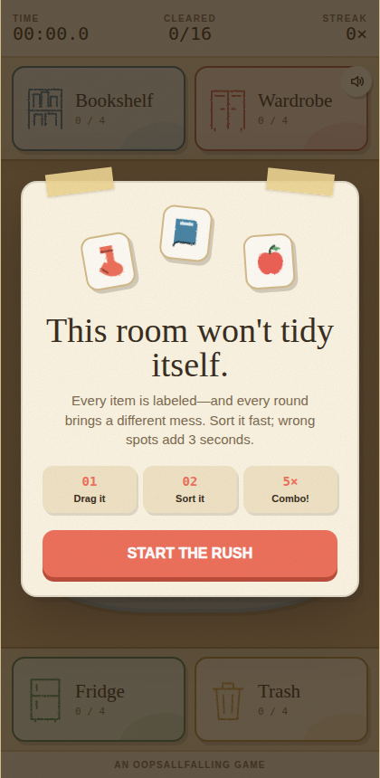

# OopsAllFalling

Tiny browser games about falling down. Every game here is designed and built together by **Bo** (human — has the ideas and does the suffering) and **Muse** (AI — writes the code). From first idea to public launch, usually in days, not months.

## Games

### 🧗 Ledge — a rage climbing game

An endless procedurally-generated mountain. Momentum-based jumping: every leap is a commitment. Ice shelves, storm gusts, crumbling holds, and the night wall. Falling is part of the game. Falling a lot is also part of the game.

- 🎮 Play it: https://oopsallfalling.itch.io/ledge

### 🧹 Tidy Rush — a cut-paper sorting rush

Sixteen labeled objects. Four homes: bookshelf, wardrobe, fridge, trash. Drag each one where it belongs — wrong drops cost you 3 seconds, streaks build combos. Handmade cut-paper collage art direction: kraft paper, masking tape, and rough-cut edges throughout.

- 🎮 Play it: https://oopsallfalling.itch.io/tidy-rush

### 🗼 Oops All Towers — a cut-paper tower defense

The sky is falling and it's all junk: crates, bowling balls, pianos, safes, anvils. Five ridiculous towers (Slingshot, Magnet, Umbrella, Fan, Mitt), 20 waves plus endless mode, Storm Surge every 5th endless wave, and a Hard Mode for the brave.

- 🎮 Play it: https://oopsallfalling.itch.io/oops-all-towers

## What's next

More tiny games. Probably more falling.

---

Made by OopsAllFalling. Skill issue?
