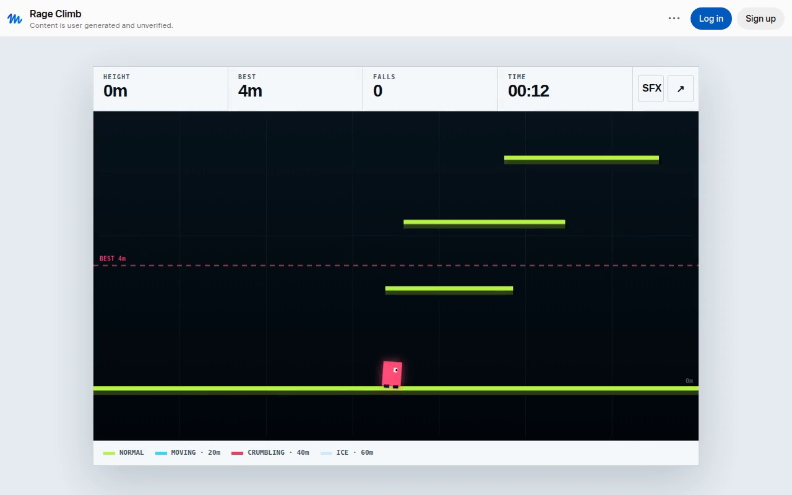

# OopsAllFalling

Tiny browser games about falling down. Every game here is designed and built together by **Bo** (human — has the ideas and does the suffering) and **Muse** (AI — writes the code). From first idea to public launch, usually in days, not months.

## Games

### 🧗 Ledge — a rage climbing game

An endless procedurally-generated mountain. Momentum-based jumping: every leap is a commitment. Ice shelves, storm gusts, crumbling holds, and the night wall. Falling is part of the game. Falling a lot is also part of the game.

- 🎮 Play it: https://oopsallfalling.itch.io/ledge
- 🌐 Mirror: https://yuanb10.github.io/OopsAllFalling/ledge/

**Dev notes**

- Built September 2026 — from idea to itch.io launch in about 2 days.
- One self-contained HTML file. No frameworks, no build step, no backend.
- Our first external playtester liked it and immediately found a progression softlock (temporary platforms vanished forever). Fixed: platforms respawn now.
- iOS Safari fought us twice before launch: long-press triggering the text magnifier menu, and touch buttons getting stuck in the "pressed" state. Both fixed.
- One-tap share card (1080×1920, essential content inside a 4:5 safe area) so your suffering is Instagram-Story-ready.
- Best height resets every session. The mountain doesn't care about your past achievements.

## What's next

More tiny games. Probably more falling.

---

Made by OopsAllFalling. Skill issue?
